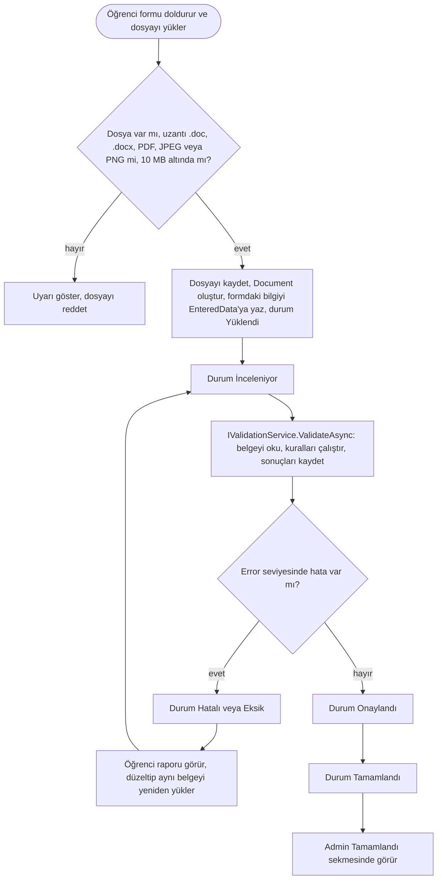

# Belge yükleme ve doğrulama akışı

```mermaid
flowchart TD
    A(["Öğrenci formu doldurur ve dosyayı yükler"]) --> B{"Dosya var mı, uzantı .doc, .docx, PDF, JPEG veya PNG mi, 10 MB altında mı?"}
    B -->|"hayır"| C["Uyarı göster, dosyayı reddet"]
    B -->|"evet"| D["Dosyayı kaydet, Document oluştur, formdaki bilgiyi EnteredData'ya yaz, durum Yüklendi"]
    D --> E["Durum İnceleniyor"]
    E --> F["IValidationService.ValidateAsync: belgeyi oku, kuralları çalıştır, sonuçları kaydet"]
    F --> J{"Error seviyesinde hata var mı?"}
    J -->|"evet"| K["Durum Hatalı veya Eksik"]
    K --> L["Öğrenci raporu görür, düzeltip aynı belgeyi yeniden yükler"]
    L --> E
    J -->|"hayır"| M["Durum Onaylandı"]
    M --> N["Durum Tamamlandı"]
    N --> O["Admin Tamamlandı sekmesinde görür"]
```