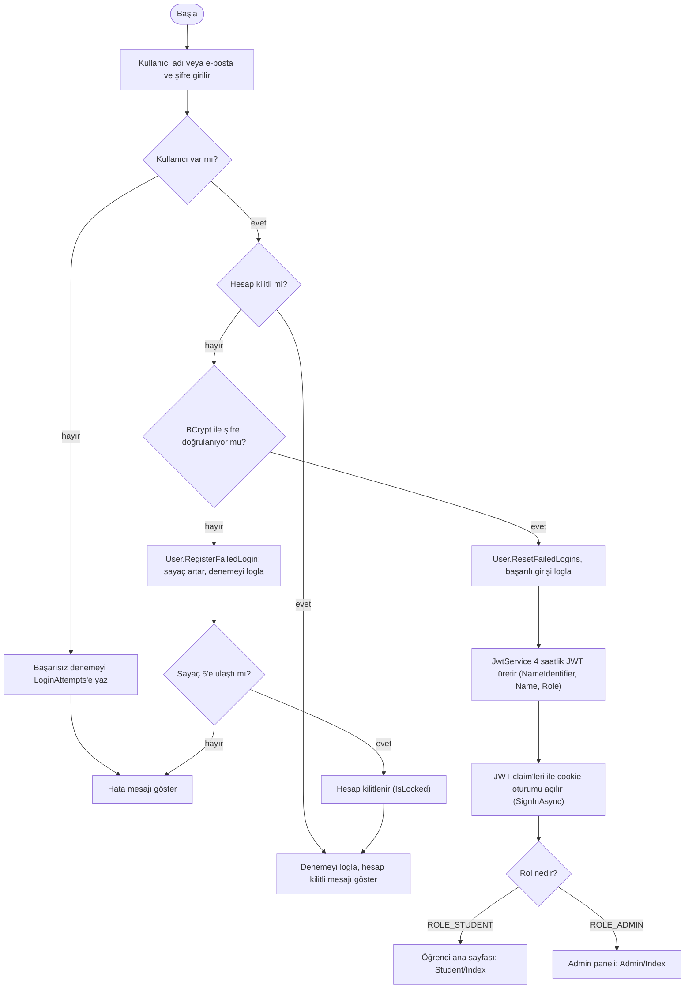

# Giriş akışı

Kaynak kod: `AuthService.LoginAsync`, `AuthController.Login`, `JwtService.GenerateToken`

```mermaid
flowchart TD
    A(["Başla"]) --> B["Kullanıcı adı veya e-posta ve şifre girilir"]
    B --> C{"Kullanıcı var mı?"}
    C -->|"hayır"| D["Başarısız denemeyi LoginAttempts'e yaz"]
    D --> E["Hata mesajı göster"]
    C -->|"evet"| F{"Hesap kilitli mi?"}
    F -->|"evet"| G["Denemeyi logla, hesap kilitli mesajı göster"]
    F -->|"hayır"| H{"BCrypt ile şifre doğrulanıyor mu?"}
    H -->|"hayır"| I["User.RegisterFailedLogin: sayaç artar, denemeyi logla"]
    I --> J{"Sayaç 5'e ulaştı mı?"}
    J -->|"evet"| K["Hesap kilitlenir (IsLocked)"]
    J -->|"hayır"| E
    K --> G
    H -->|"evet"| L["User.ResetFailedLogins, başarılı girişi logla"]
    L --> M["JwtService 4 saatlik JWT üretir (NameIdentifier, Name, Role)"]
    M --> N["JWT claim'leri ile cookie oturumu açılır (SignInAsync)"]
    N --> O{"Rol nedir?"}
    O -->|"ROLE_STUDENT"| P["Öğrenci ana sayfası: Student/Index"]
    O -->|"ROLE_ADMIN"| Q["Admin paneli: Admin/Index"]
```
