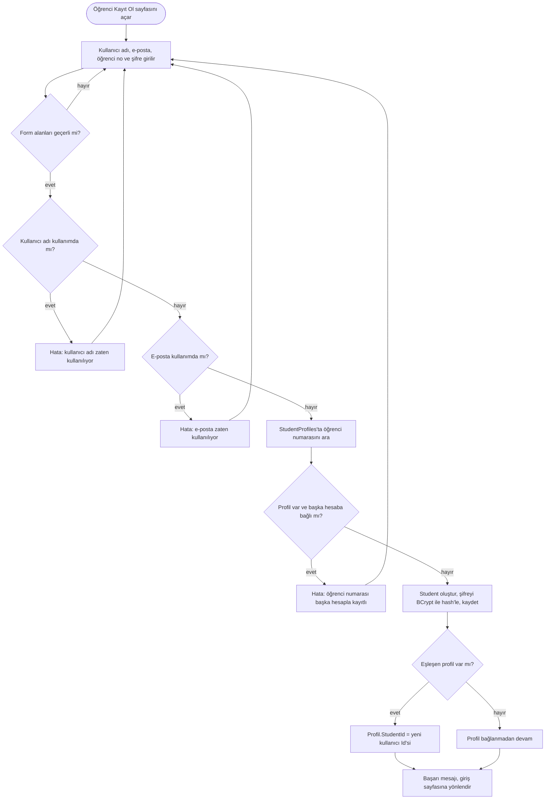

# Kayıt (hesap oluşturma) akışı

Kaynak kod: `AuthController.Register`, `AuthService.RegisterAsync`

```mermaid
flowchart TD
    A(["Öğrenci Kayıt Ol sayfasını açar"]) --> B["Kullanıcı adı, e-posta, öğrenci no ve şifre girilir"]
    B --> C{"Form alanları geçerli mi?"}
    C -->|"hayır"| B
    C -->|"evet"| D{"Kullanıcı adı kullanımda mı?"}
    D -->|"evet"| E["Hata: kullanıcı adı zaten kullanılıyor"]
    D -->|"hayır"| F{"E-posta kullanımda mı?"}
    F -->|"evet"| G["Hata: e-posta zaten kullanılıyor"]
    F -->|"hayır"| H["StudentProfiles'ta öğrenci numarasını ara"]
    H --> I{"Profil var ve başka hesaba bağlı mı?"}
    I -->|"evet"| J["Hata: öğrenci numarası başka hesapla kayıtlı"]
    I -->|"hayır"| K["Student oluştur, şifreyi BCrypt ile hash'le, kaydet"]
    K --> L{"Eşleşen profil var mı?"}
    L -->|"evet"| M["Profil.StudentId = yeni kullanıcı Id'si"]
    L -->|"hayır"| N["Profil bağlanmadan devam"]
    M --> O["Başarı mesajı, giriş sayfasına yönlendir"]
    N --> O
    E --> B
    G --> B
    J --> B
```
