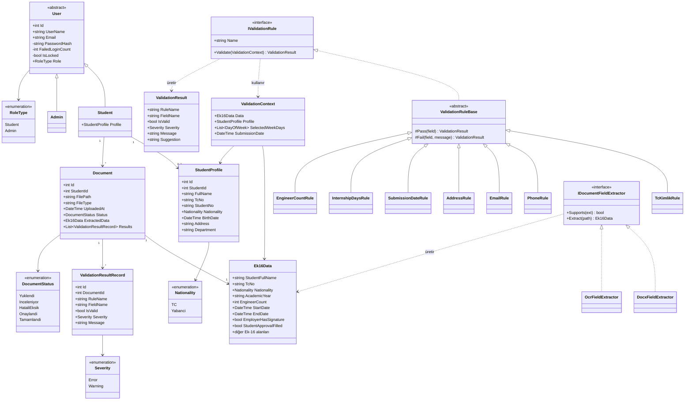

# Class diyagramı

```mermaid
classDiagram
    class User {
        <<abstract>>
        +int Id
        +string UserName
        +string Email
        -string PasswordHash
        -int FailedLoginCount
        -bool IsLocked
        +RoleType Role
    }
    class Student {
        +StudentProfile Profile
    }
    class Admin
    User <|-- Student
    User <|-- Admin

    class StudentProfile {
        +int Id
        +int StudentId
        +string FullName
        +string TcNo
        +string StudentNo
        +Nationality Nationality
        +DateTime BirthDate
        +string Address
        +string Department
    }
    class Document {
        +int Id
        +int StudentId
        +string FilePath
        +string FileType
        +DateTime UploadedAt
        +DocumentStatus Status
        +Ek16Data ExtractedData
        +List~ValidationResultRecord~ Results
    }
    class Ek16Data {
        +string StudentFullName
        +string TcNo
        +Nationality Nationality
        +string AcademicYear
        +int EngineerCount
        +DateTime StartDate
        +DateTime EndDate
        +bool EmployerHasSignature
        +bool StudentApprovalFilled
        +diğer Ek-16 alanları
    }
    class ValidationResultRecord {
        +int Id
        +int DocumentId
        +string RuleName
        +string FieldName
        +bool IsValid
        +Severity Severity
        +string Message
    }
    Student "1" --> "0..1" StudentProfile
    Student "1" --> "*" Document
    Document "1" --> "1" Ek16Data
    Document "1" --> "*" ValidationResultRecord

    class DocumentStatus {
        <<enumeration>>
        Yuklendi
        Inceleniyor
        HataliEksik
        Onaylandi
        Tamamlandi
    }
    class RoleType {
        <<enumeration>>
        Student
        Admin
    }
    class Nationality {
        <<enumeration>>
        TC
        Yabanci
    }
    class Severity {
        <<enumeration>>
        Error
        Warning
    }
    Document --> DocumentStatus
    User --> RoleType
    StudentProfile --> Nationality
    ValidationResultRecord --> Severity

    class IValidationRule {
        <<interface>>
        +string Name
        +Validate(ValidationContext) ValidationResult
    }
    class ValidationRuleBase {
        <<abstract>>
        #Pass(field) ValidationResult
        #Fail(field, message) ValidationResult
    }
    class TcKimlikRule
    class PhoneRule
    class EmailRule
    class AddressRule
    class SubmissionDateRule
    class InternshipDaysRule
    class EngineerCountRule
    IValidationRule <|.. ValidationRuleBase
    ValidationRuleBase <|-- TcKimlikRule
    ValidationRuleBase <|-- PhoneRule
    ValidationRuleBase <|-- EmailRule
    ValidationRuleBase <|-- AddressRule
    ValidationRuleBase <|-- SubmissionDateRule
    ValidationRuleBase <|-- InternshipDaysRule
    ValidationRuleBase <|-- EngineerCountRule

    class ValidationContext {
        +Ek16Data Data
        +StudentProfile Profile
        +List~DayOfWeek~ SelectedWeekDays
        +DateTime SubmissionDate
    }
    class ValidationResult {
        +string RuleName
        +string FieldName
        +bool IsValid
        +Severity Severity
        +string Message
        +string Suggestion
    }
    IValidationRule ..> ValidationContext : kullanır
    IValidationRule ..> ValidationResult : üretir
    ValidationContext --> Ek16Data
    ValidationContext --> StudentProfile

    class IDocumentFieldExtractor {
        <<interface>>
        +Supports(ext) bool
        +Extract(path) Ek16Data
    }
    class DocxFieldExtractor
    class OcrFieldExtractor
    IDocumentFieldExtractor <|.. DocxFieldExtractor
    IDocumentFieldExtractor <|.. OcrFieldExtractor
    IDocumentFieldExtractor ..> Ek16Data : üretir
```