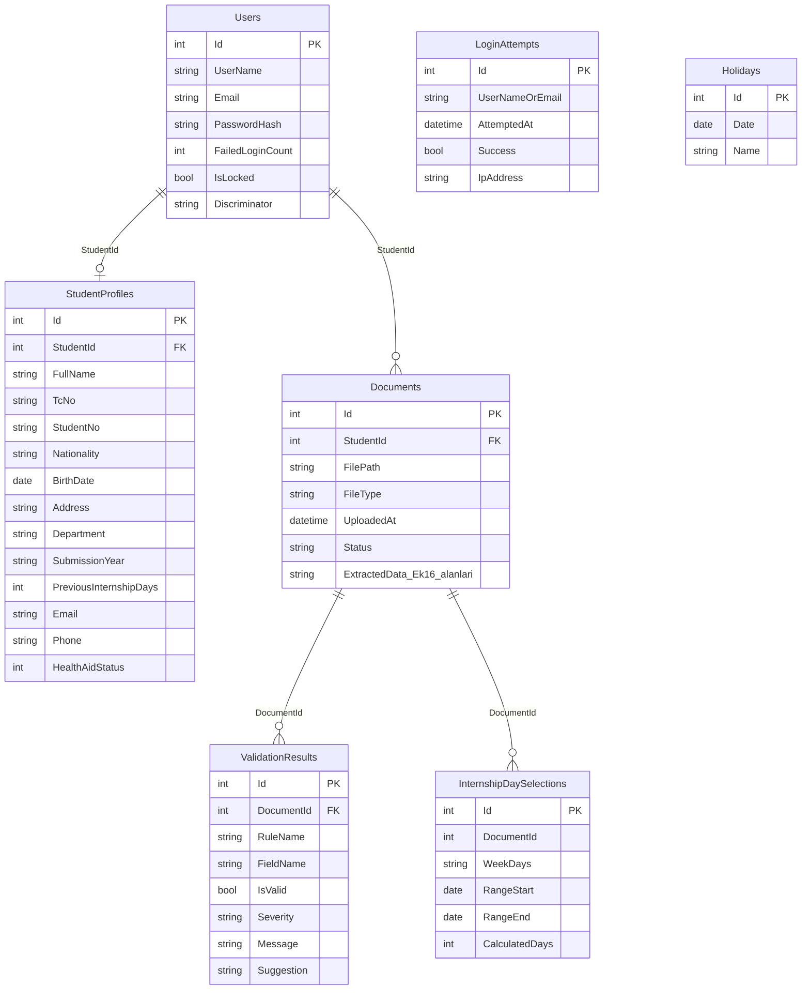

# Veri Tabanı (ER) Diyagramı

```mermaid
erDiagram
    Users ||--o| StudentProfiles : "StudentId"
    Users ||--o{ Documents : "StudentId"
    Documents ||--o{ ValidationResults : "DocumentId"
    Documents ||--o{ InternshipDaySelections : "DocumentId"

    Users {
        int Id PK
        string UserName
        string Email
        string PasswordHash
        int FailedLoginCount
        bool IsLocked
        string Discriminator
    }
    StudentProfiles {
        int Id PK
        int StudentId FK
        string FullName
        string TcNo
        string StudentNo
        string Nationality
        date BirthDate
        string Address
        string Department
        string SubmissionYear
        int PreviousInternshipDays
        string Email
        string Phone
        int HealthAidStatus
    }
    Documents {
        int Id PK
        int StudentId FK
        string FilePath
        string FileType
        datetime UploadedAt
        string Status
        string ExtractedData_Ek16_alanlari
    }
    ValidationResults {
        int Id PK
        int DocumentId FK
        string RuleName
        string FieldName
        bool IsValid
        string Severity
        string Message
        string Suggestion
    }
    InternshipDaySelections {
        int Id PK
        int DocumentId
        string WeekDays
        date RangeStart
        date RangeEnd
        int CalculatedDays
    }
    LoginAttempts {
        int Id PK
        string UserNameOrEmail
        datetime AttemptedAt
        bool Success
        string IpAddress
    }
    Holidays {
        int Id PK
        date Date
        string Name
    }
```