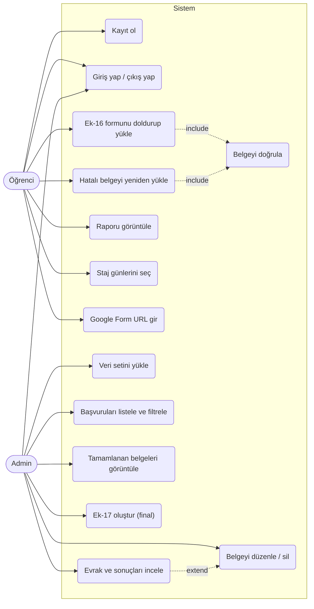

# Use Case Diyagramı

```mermaid
flowchart LR
    S([Öğrenci])
    A([Admin])
    subgraph Sistem
        U0("Kayıt ol")
        U1("Giriş yap / çıkış yap")
        U2("Ek-16 formunu doldurup yükle")
        U2b("Hatalı belgeyi yeniden yükle")
        U3("Raporu görüntüle")
        U4("Staj günlerini seç")
        U5("Google Form URL gir")
        U6("Veri setini yükle")
        U7("Başvuruları listele ve filtrele")
        U8("Tamamlanan belgeleri görüntüle")
        U9("Ek-17 oluştur (final)")
        U10("Belgeyi doğrula")
        U11("Evrak ve sonuçları incele")
        U12("Belgeyi düzenle / sil")
    end
    S --> U0
    S --> U1
    S --> U2
    S --> U2b
    S --> U3
    S --> U4
    S --> U5
    A --> U1
    A --> U6
    A --> U7
    A --> U8
    A --> U9
    A --> U11
    A --> U12
    U2 -.->|"include"| U10
    U2b -.->|"include"| U10
    U11 -.->|"extend"| U12
```
